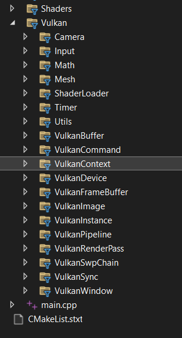

# Vulkan Boilerplate (C++)

🚀 A modular and scalable Vulkan boilerplate written in modern C++, designed to help you get started with graphics programming and Vulkan API projects.

## 📸 Preview
<p align="center">
  
</p>

## 🧩 Features

- 🧱 Modular Architecture — Clean separation of concerns
- 🌀 VulkanContext, SwapChain, Device, RenderPass, etc.
- 🎮 Integrated Camera & Input Systems
- 🧮 Custom Math and Timer Utilities
- 📦 Easy Shader Management
- 🎥 Ready for 3D + 2D interaction (useful for simulation, silhouette carving, etc.)

## 📁 Folder Structure

```
Vulkan/
├── Camera/
├── Input/
├── Math/
├── Mesh/
├── ShaderLoader/
├── Timer/
├── Utils/
├── VulkanBuffer/
├── VulkanCommand/
├── VulkanContext/
├── VulkanDevice/
├── VulkanFrameBuffer/
├── VulkanImage/
├── VulkanInstance/
├── VulkanPipeline/
├── VulkanRenderPass/
├── VulkanSwpChain/
├── VulkanSync/
├── VulkanWindow/
main.cpp
Shaders/
assets/
```

## ⚙️ Build Instructions

### Prerequisites

- CMake ≥ 3.16
- Vulkan SDK
- GLFW
- GLM

### Build (Linux/Windows)

```bash
git clone https://github.com/ragulnathMB/VulkanProjectTemplate.git
cd VulkanProjectTemplate
```

## 📘 Why This Repo?

- You want to **skip the boring setup** and get to rendering.
- You want a reusable **starting point for multiple Vulkan projects**.
- You prefer **organized modular code** instead of a giant `main.cpp`.

## 🤝 Contributing

Pull requests and suggestions are welcome! If this helped you, feel free to share and ⭐ the repo.

## 📜 License

MIT License - see the [LICENSE](LICENSE) file.